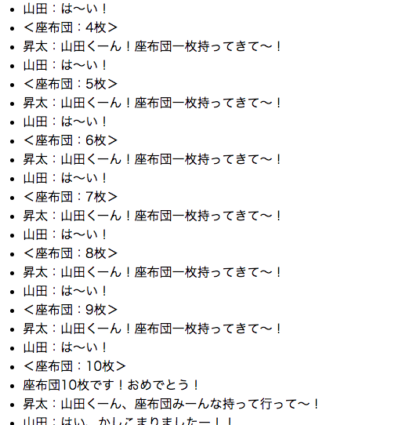

Pythonで、双方向通信ができるWebSocketを利用して、アプリを作成しました。  
<https://websockets.readthedocs.io/en/stable/intro.html#browser-based-example>  
このアプリは、上記を応用したものです。  
日本の人気テレビ番組に、面白いことを言って座布団を10枚獲得するというものがあります。  
その番組での座布団の動きを、とてもシンプルに表現したものがこのアプリです。  
  

まず test5.py を実行します。  
次に test5.html をブラウザで開きます。  
  
関数 oogiri を while True つまり延々と実行し続けます。  
range(10)で、座布団が10枚溜まるまでの処理を行います。  
range(10)が終わると、zabuton_10 などが呼ばれ、countは0にリセットされてまた最初から始まります。  
